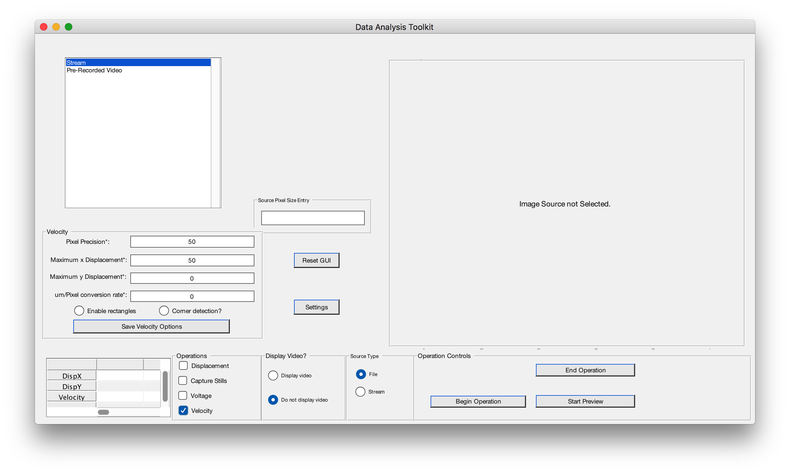
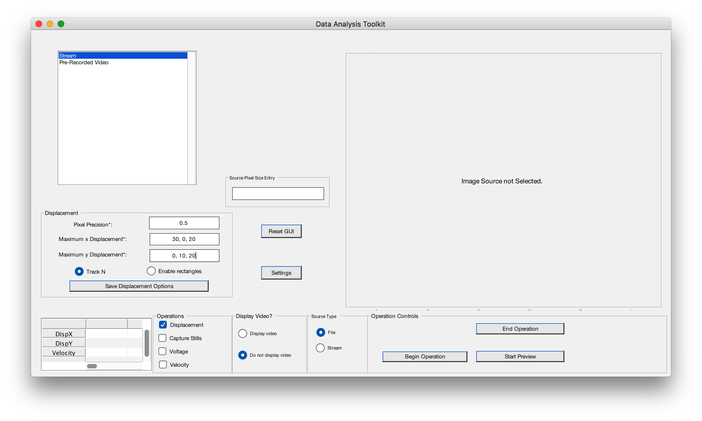

# README

MAAP is a set of tools used for tracking the movement of objects. 

## Getting Started

Download the source files. 


```
git clone https://github.com/wfehrnstrom/MAAP
```

Add the directory to your Matlab Path. Make sure to `Add with Subfolders…` when you do so.  
Click on the `Home` tab, and the `Set Path` button will be in the `Environment` section. 

Note: It is suggested that you do not add the entire directory in order to avoid the .git directory that would be added. 

## Usage

In order to start the gui, 

There are currently two operations that are currently supported

- Displacement
- Velocity

In both cases, you first need to pick the video file you want to act one. 

*While it is possible to use a streaming video, this feature is not very well tested. As such this documentation will go assume that a file as been picked*

{width=50%}

Click on the `Pre-Recorded Video` option in the list shown in the image above to get begin browsing your files. 

Once you choose a file, simply click it. When it is highlighted blue, it is selected. 

Choose the `Operation` you would like. Although there are four options, only Displacement and Velocity is supported.

*Notice that although the buttons are not radio buttons (and it is possible to select more than one) the application will only do one of them. Currently, the operations are listed in the order of precedence (If you pressed Displacement then Velocity, it would do the Displacement Operation; If you picked Velocity then Displacement, it would still do the Displacement Operation).*

{width=48%} {width=48%}

### Displacement

We'll first go through how to use the displacement operation

If you're only trying to track 1 item, fill in the fields appropriately. 

- **Pixel Precision**: For subpixel precision, write what percentage of a pixel you would like to find. For example, to get accuracy up to1/2 a pixel precision, write `0.5`. However, the smaller the number, the longer the operation will take
- **Maximum _ Displacement**: This is a guess on your part of how many pixels you expect the object you're tracking to move laterally or vertically. Put `0` if you don't care about one direction of movement.

{width=50%}

Once you put the values in, if you would like to save those values, simply press the `Save Displacement Variables` button. The next time you open the gui, those fields will be filled in automatically. 

Once these fields are inputted, press `Begin Operation` on the right hand side. You'll be prompted to give an input of what you want to track. Simply click and drag to create a blue box around the object you would like to track and double click inside that box. The operation will commence!

There are several options now at your disposal. 
- `Enable rectangles` button: This will show the blue box around the object you're tracking as the video plays
- Track N button: This will allow you to track more than one object at a time

{width=50%}

As you can see, to track multiple object, you need to input different **Maximum _ Displacement** values for each object. Separate them with commas. In the above example, you would be trying to track 3 objects. 

### Velocity

Velocity is similiar to Displacement. 

{width=50%}

The only difference is the **um/Pixel** rate. 
- **um/Pixel**: The conversin rate from pixel to micrometers. If this isn't of concern and you would only like to know the movement in relation to pixel, simply put in `1`. While the velocity values will be wholly incorrect (as it'll treat 1pixel=1um), you can simply do multiply by a conversion rate later. 

There are several options at your disposal
- `Enable rectangles` is the same as before
- `Corner dtection?` is a specific implementation for use in the Swarm Lab. In general, don't use it. 

### Seeing the video

By default, the application won't show you the video as it records data. In order to see it, simply toggle the `Display video` button. 

## The Data

After the application is complete, the data is saved in the `saved_data` directory with the following format:

`OperationName.DD-Mon-YYYY HH:MM:SS.csv`

